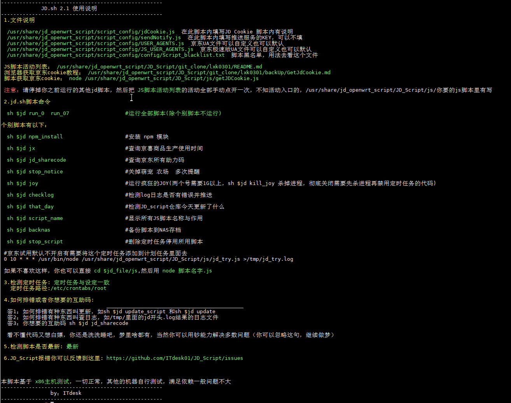

# JD_Script

## 序言
   脚本来源：https://github.com/ITdesk01/JD_Script
   调用https://github.com/LXK9301/jd_scripts/tree/master 进行测试学习，在X86机器使用正常，其他机器满足依赖应该问题不大,
   
   **lxk0301大佬的JS脚本里面的助力码替换成我的了，默认会给我助力，如果你不需要自行删除代码或者禁用他**

## 支持系统
openwrt X86 （基于x86编写）

竟斗云路由器（群友极地阳光测试）

N1（群友极地阳光测试）

感谢作者ITdesk01 lxk0301 shylocks大佬的脚本

**注意1（设备Rom小于128M别折腾了，你装不下依赖，不用往下看了，RAM最好大点1G左右，512M也行就是不能跑太多账号，不然会死机）**

**注意2（linux底子太薄的，建议好好学习一下，这不是无脑脚本，最起码你要看懂底下操作是做啥的）**

## Usage 使用方法
**1.使用一键脚本进行安装，如果执行出现443错误，请检查你的代理方式和dns是否正确**

         `wget -q https://raw.githubusercontent.com/firkerword/KPR/main/jd.sh -O jd.sh && chmod +x jd.sh && ./jd.sh`

安装完成之后最好重启下openwrt

**2.设置脚本**

2.1 抓取 https://bean.m.jd.com/  的cookie

2.2 推荐使用Google Chrome浏览器的无痕模式打开京东签到登录页面并使用手机验证码登入 [浏览器获取京东cookie教程](https://gitee.com/lxk0301/jd_scripts/blob/master/backUp/GetJdCookie.md)

2.3 脚本二维码登录，据说有效期是90天：

2.3.1 执行 `node $jd_file/js/getJDCookie.js` # 获取登录二维码

2.3.2 扫码将获取到的cookie复制填写到jdCookie.js脚本

2.4 用winscp工具连接openwrt，进入usr/share/JD_Script目录找到***jdCookie.js***和***sendNotify.js***文件

打开jdCookie.js文件进行编辑，将抓取到的cookie填写进文本第7行开头的单引号内，并保存，注意不要漏掉或删除字符

打开sendNotify.js文件进行编辑，填写微信或者TG或者其他推送平台的推送码，注意不要漏掉或删除字符

设置完成以后可以用以下代码

         sh $jd #直接调用代码

         cd $jd_file # 可以直接进入代码所在文件夹

**3.已知问题!!!**

1.下载下来的js都是空的，建议强制代理raw.githubusercontent.com或检查dns设置

2.互助码怎么找

         sh $jd jd_sharecode

**4.问题反馈：https://github.com/ITdesk01/JD_Script/issues (描述清楚问题或者上图片，不然可能没有人理)**

**吹水群** :**667491026** (公子大爷请绕道，白嫖可能没人理)

## 你们可以不好好看安装依赖，我也可以拒绝回答任何问题。

## 特别声明:

* 本仓库发布的JD_Script项目中涉及的任何脚本，仅用于测试和学习研究，禁止用于商业用途，不能保证其合法性，准确性，完整性和有效性，请根据情况自行判断.

* 本项目内所有资源文件，禁止任何公众号、自媒体进行任何形式的转载、发布。

* ITdesk01对任何脚本问题概不负责，包括但不限于由任何脚本错误导致的任何损失或损害.

* 间接使用脚本的任何用户，包括但不限于建立VPS或在某些行为违反国家/地区法律或相关法规的情况下进行传播, ITdesk01对于由此引起的任何隐私泄漏或其他后果概不负责.

* 请勿将JD_Script项目的任何内容用于商业或非法目的，否则后果自负.

* 如果任何单位或个人认为该项目的脚本可能涉嫌侵犯其权利，则应及时通知并提供身份证明，所有权证明，我们将在收到认证文件后删除相关脚本.

* 任何以任何方式查看此项目的人或直接或间接使用该JD_Script项目的任何脚本的使用者都应仔细阅读此声明。ITdesk01保留随时更改或补充此免责声明的权利。一旦使用并复制了任何相关脚本或JD_Script项目的规则，则视为您已接受此免责声明.

 **您必须在下载后的24小时内从计算机或手机中完全删除以上内容.**   
> ***您使用或者复制了本仓库且本人制作的任何脚本，则视为`已接受`此声明，请仔细阅读***
